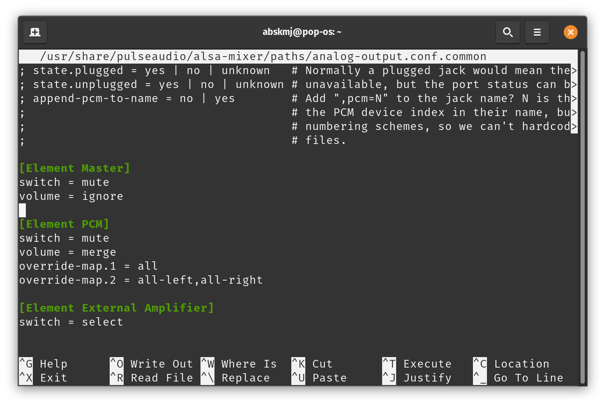
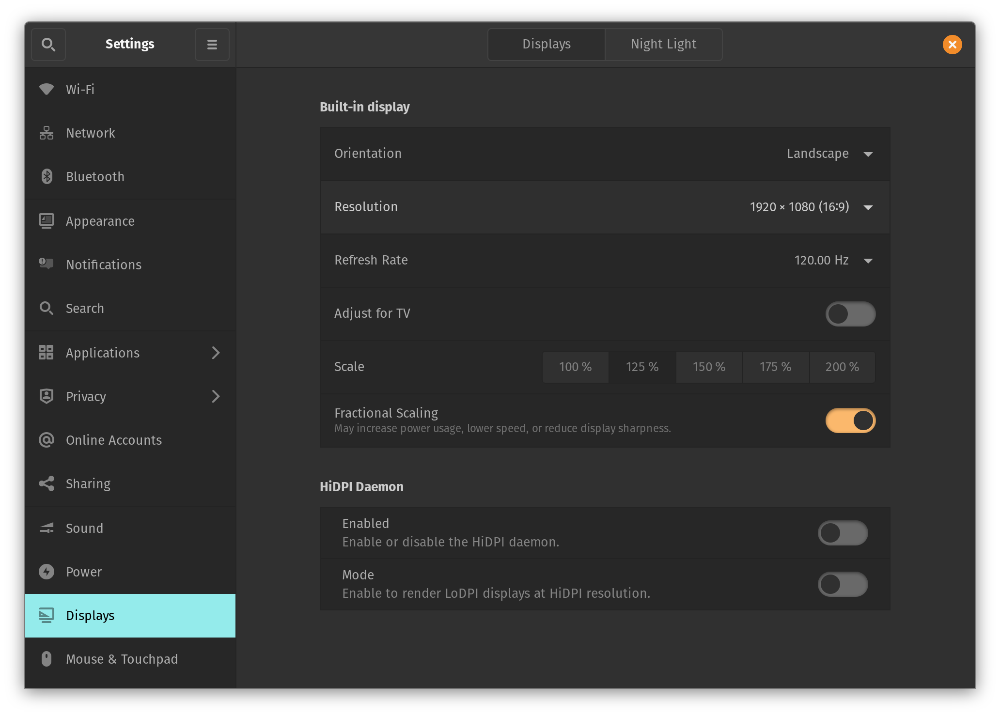

Install Pop 20.10 next to Windows 10 in a multi-boot setup. Similar steps can be followed to install Ubuntu 20.10.

# Demo Mode on Live USB
> Fast startup option in Windows 10 and the secure boot option in BIOS needs to be disabled

- Download PopOS 20.10 with NVIDIA drivers ISO from [the official site](https://pop.system76.com/)
- Create a live USB following [the guide](https://support.system76.com/articles/live-disk/)
- Restart the laptop and press or hold the `ESC` key when the `Republic of Gamers` logo is seen on the screen
- Select second EFI partition to boot into PopOS from USB
- Follow [the guide](https://support.system76.com/articles/install-pop/) to try the Demo Mode 

# Install on SSD
The steps below are to install PopOS keeping the Windows 10 system intact

- Click `Custom (Advanced)` to make a new partition on SSD for PopOS
- Click on `Modify Partitions`
- Right-click on the main SSD partition of around 450+ GB and select resize.
- Enter the sum of sizes for the new partitions and click on `Resize/Move`. This will create a new unallocated partition

  | Name / Label | Size | File System | Use as |
  | --- | --- | --- | --- |
  | EFI | 500 MiB | fat32 | Boot |
  | PopOS | Min. 20 GiB | ext4 | Root (/) |
  | Swap | Optional | linux-swap | Swap | 

- Right-click on the unallocated partition and create new partitions as the above table
- After partitions are modified, click on the green tick to create them on SSD
- Find the new partitions and toggle the `Use Partition` option and choose `Use as` according to the above table
- Click on `Erase and Install`
- Click on `Restart` when the installation is complete

> After installation, the laptop will load PopOS by default from now on. To use Windows 10, press or hold the `ESC` key when the `Republic of Gamers` logo is seen and select `Windows Boot Manager` each time.

# Setup after installation

## ASUS Packages
Install below packages to use the function key combinations, Animatrix display, fan speed, and graphic modes. A complete list of features is available at [gitlab.com](https://gitlab.com/asus-linux/asus-nb-ctrl#implemented).
- [hid-asus-rog](https://gitlab.com/asus-linux/hid-asus-rog)
- [asus-rog-nb-wmi](https://gitlab.com/asus-linux/asus-rog-nb-wmihttps://gitlab.com/asus-linux/asus-rog-nb-wmi)
- [asus-nb-ctrl](https://gitlab.com/asus-linux/asus-nb-ctrl)

Add these packages using package manager
```bash
echo "deb https://download.opensuse.org/repositories/home:/luke_nukem:/asus/xUbuntu_20.04/ /" | sudo tee /etc/apt/sources.list.d/asus.list
wget -q -O - https://download.opensuse.org/repositories/home:/luke_nukem:/asus/xUbuntu_20.04/Release.key | sudo apt-key add -
apt-get update
apt-get install dkms-hid-asus-rog dkms-asus-rog-nb-wmi asus-nb-ctrl
```

## Volume Control
Add below lines to `/usr/share/pulseaudio/alsa-mixer/paths/analog-output.conf.common` file, just before the `[Element PCM]` section. This will also make the `mute the microphone` button usable.

```
[Element Master]
switch = mute
volume = ignore
```



## System Time in Windows & PopOS
Update the below `timedatectl` configuration in PopOS. Details are available at [support.system76.com](https://support.system76.com/articles/dual-booting/)

```
timedatectl set-local-rtc 1 --adjust-system-clock
```

## Text on screen too small
Out of the box, the text on the screen is too small to read. Enable `Fractional Scaling` in `Settings > Displays` to 125% or 150% for a comfortable reading.



# Known Issues
- No fingerprint login
- No display in external monitor using the USB-C port (external display using HDMI port works)

# Test Laptop
The above steps are tested on the below laptop model.

ASUS ROG Zephyrus G14 GA401IH-HE012T
- AMD Ryzen 5 4600HS
- NVIDIA GeForce GTX 1650 4GB GDDR6 VRAM
- 8GB DDR4 3200MHz SDRAM
- 512GB M.2 NVMe PCIe 3.0 SSD
- Without Anime Matrix

# References
- ASUS G14 Ubuntu 20.04 Setup at [reddit.com](https://www.reddit.com/r/ZephyrusG14/comments/id4e2d/asus_g14_ubuntu_2004_setup/)
- DKMS installable module for ASUS ROG laptops at [gitlab.com](https://gitlab.com/asus-linux/hid-asus-rog)
- Installing Linux (Pop_OS!) on Asus Zephyrus G14 at [heinbio.me](https://heinbio.me/blog/5f23042bee73aa31486bff7c)