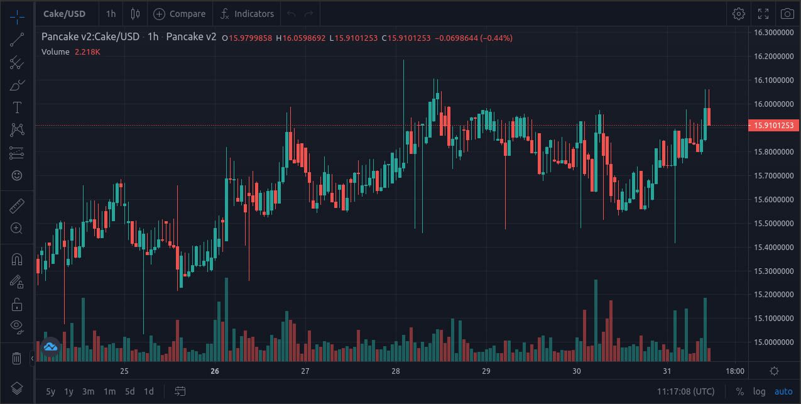
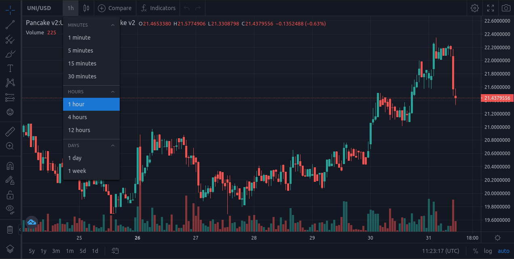

> This is an informational post for my extra available at [BuyMeACoffee.com](https://www.buymeacoffee.com/abskmj/e/39007)

# What will you get?
You will get a zip file with the source code for an OHLC Chart for PancakeSwap Tokens.

- It uses TradingView Techincal Analysis Charts as the charting library and Bitquery.io APIs as the data provider.
- Code is in HTML and Javascript.
- Prices in the charts are in BUSD.
- Supports both Pancakeswap v1 and v2 tokens
- Supports 1m,5m,15m,30m,1h,4h,12d,1d,7d timeframes

# How to use it?
You can view the chart by starting a local server and opening it in your browser. You can also host it with any HTTP server like Nginx and Apache on a remote server. These are static files and don't need a server component other than to host them.

# Before you buy
There are a couple of prerequisites that you need to take care of before you can use it.
- Access to a copy of [TradingView Technical Analysis Charts](https://in.tradingview.com/HTML5-stock-forex-bitcoin-charting-library/?feature=technical-analysis-charts)
- An API Key from [Bitquery.io](https://bitquery.io/)

# Important Notes
- The chart is not integrated with a WebSocket or a live feed as Bitquery.io doesn't provide one. Hence, the chart will not update automatically, and you will have to refresh it manually to see the latest data.